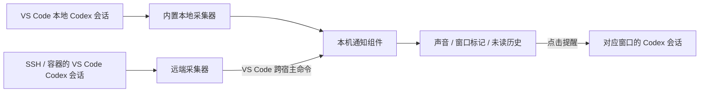

# Codex 会话通知 · Codex Session Notifier

**多个 VS Code 窗口并行使用 Codex 时，知道哪个窗口需要你。**

**Know which VS Code window needs your attention while Codex runs in parallel.**

[中文](#中文) · [English](#english) · [下载安装 / Downloads](https://github.com/lengmo1996/codex-vscode-notifier/releases/latest) · [扩展市场 / Marketplace](https://marketplace.visualstudio.com/items?itemName=lengmo1996.codex-notifier-ui) · [问题反馈 / Issues](https://github.com/lengmo1996/codex-vscode-notifier/issues)

Windows x64 · VS Code ≥ 1.96 · Python ≥ 3.8 · MIT

社区项目，非 OpenAI 或 Microsoft 官方产品。 / Community project; not an official OpenAI or Microsoft product.

## 中文

在本地文件夹、Remote SSH 和容器窗口中同时运行 Codex，不必再逐个窗口检查回复。通过声音、窗口标题标记、任务栏提示和未读列表，提示回复结束、等待审批或等待回答。

### 主要功能

| 功能 | 行为 |
| --- | --- |
| 找到对应窗口 | 回复结束显示黄色标记，审批／提问显示红色标记，窗口预览标题圆点闪动 |
| 声音与弹窗 | 三类事件默认可发声；回复结束默认不弹系统通知，可独立开启 |
| 单击回到会话 | 默认进入对应窗口的 Codex 会话侧栏，也可选择主编辑器 |
| 已读与未读 | 新提醒默认未读；点击只标读被点击的提醒；返回窗口自动标读默认关闭 |
| 历史清理 | 删除单条、清空已读或清空全部；另有隐私数据预览与清理 |
| 中英文选择 | 弹窗、日志及运行时说明可选中文或 English，默认中文，切换不重启采集 |

只关注 **VS Code Codex 扩展发起的会话**。Codex 桌面 App、CLI 和来源无法确认的会话不会触发提醒。“本轮已回复”表示本轮回复结束，不代表部署、训练或整个目标已经成功。

### 安装与开始使用

1. 在 VS Code 扩展市场安装 **Codex 会话通知**，发布者 **lengmo1996**，ID：`lengmo1996.codex-notifier-ui`。
2. 本地文件夹使用内置采集器。SSH／容器窗口运行 **Codex 通知：检查／安装当前环境组件**，按提示将配套采集器安装到对应环境。每个新环境需要检查一次。
3. 打开受信任的工作区，确保该环境有 Python，然后通过 Codex 扩展开始会话。
4. 通知菜单 → **语言 / Language** 选择语言；通过 **选择会话打开位置** 调整跳转位置。

也可从 [Releases](https://github.com/lengmo1996/codex-vscode-notifier/releases/latest) 下载审核后的 VSIX，在扩展面板 **… → 从 VSIX 安装**。Windows 安装主扩展，SSH／容器安装 `codex-notifier-collector`。主扩展通过扩展包关联配套组件，不保证自动安装到所有未来连接的远端环境。

当前源码版本：主扩展 **0.4.1**，采集器 **0.2.5**。市场版本可能稍晚于 GitHub Release。

[完整使用说明](ui/README.md#中文) · [远端安装与设置](remote/README.md#中文) · [隐私说明](PRIVACY.md) · [更新记录](ui/CHANGELOG.md)

### 隐私与隔离

- 没有公共通知服务器，不把会话同步到其他安装者；通知组件不向 GitHub 上传会话。
- 组件传递事件类型、来源、目录和会话标识等元数据，不转发对话正文。
- Windows 本机通信使用当前用户限定的管道、TLS 双向认证和本机受保护凭据。
- 缓存默认保留 7 天，可选 1–30 天。隐私清理会先预览并暂停采集，不删除原始对话、登录信息和项目文件。
- 共享同一个操作系统账号或远端 Codex Home 不构成独立用户隔离。完整边界见 [PRIVACY.md](PRIVACY.md)。

### 工作方式与限制

Windows 合并任务栏按钮显示汇总颜色，扩展不能让整张缩略图背景闪动。系统勿扰或静音会影响提醒。跳转依赖 Codex 与 VS Code 接口，侧栏跳转请求被接受不等于后端恢复成功；兼容性变化或快速切换窗口可能导致跳转失败。审批 Hook 仍需你在 Codex 中核对并信任，扩展不代替审批。

遇到问题请 [提交 Issue](https://github.com/lengmo1996/codex-vscode-notifier/issues/new/choose)，提供版本、窗口类型和复现步骤。先遮盖日志中的私人路径、服务器地址和会话标识。安全问题请按 [安全报告说明](SECURITY.md) 私下报告。

## English

Run Codex in multiple local-folder, Remote SSH, and container windows without checking each one manually. Sound, window title markers, taskbar attention, and unread history show when a reply ends or Codex needs approval or an answer.

### Features

| Feature | Behavior |
| --- | --- |
| Identify the window | Yellow for finished replies, red for approvals/questions, and a blinking dot in the preview title |
| Sound and popups | Sounds are enabled by default for all three event types; reply-end desktop popups are separately configurable and off by default |
| Open the session | Click to open the target window's Codex sidebar; the main editor is optional |
| Read states | New notifications remain unread; clicking reads only that notification; automatic window-wide reading is off by default |
| History and cleanup | Delete one notification, clear read/all notifications, or preview and clear private notification data |
| Language | Choose Chinese or English for popups, logs, and runtime labels; Chinese is the default; switching does not restart collection |

Only sessions started through the **Codex extension in VS Code** are eligible. Desktop App, CLI, and unclassified sessions are excluded. “Reply finished” means the turn ended; it does not assert that a deployment, training job, or overall goal succeeded.

### Get started

1. Install **Codex 会话通知** by **lengmo1996** from the [Marketplace](https://marketplace.visualstudio.com/items?itemName=lengmo1996.codex-notifier-ui), ID `lengmo1996.codex-notifier-ui`.
2. Local folders use the built-in collector. In each SSH/container window, run **Check / install components for this environment** and install the companion there.
3. Open a trusted workspace with Python available in that environment, then start a session using the Codex extension.
4. Use **语言 / Language** in the notification menu to choose Chinese or English, and choose where notification clicks open sessions.

For offline installation, download the reviewed VSIX files from [Releases](https://github.com/lengmo1996/codex-vscode-notifier/releases/latest) and use **Extensions → … → Install from VSIX**. Install the main extension on Windows and `codex-notifier-collector` in the SSH/container environment. The extension pack links the companion but cannot guarantee installation in every future remote environment.

Current source versions: main extension **0.4.1**, collector **0.2.5**. Marketplace updates may arrive after the GitHub release.

[Full user guide](ui/README.md#english) · [Remote collector guide](remote/README.md#english) · [Privacy policy](PRIVACY.md#english) · [Changelog](ui/CHANGELOG.md)

### Privacy and limitations

There is no public notification server or cross-user session synchronization. The notification components do not upload sessions to GitHub. They exchange event metadata rather than conversation bodies. Windows IPC uses current-user permissions, mutual TLS, and protected local credentials. Cache retention defaults to 7 days, configurable to 1–30 days. Previewed privacy cleanup preserves original conversations, sign-in information, and project files. Sharing an OS account or remote Codex Home does not provide separate-user isolation; see the [privacy policy](PRIVACY.md#english).

Grouped taskbar buttons show aggregate attention; the extension cannot flash an entire thumbnail background. Focus Assist and mute settings can suppress alerts. Session navigation depends on Codex and VS Code interfaces; an accepted sidebar request does not prove backend restoration succeeded. Approval hooks still require your review and trust in Codex.

[Report a bug or request a feature](https://github.com/lengmo1996/codex-vscode-notifier/issues/new/choose). Redact private data first. Report security issues privately as described in [SECURITY.md](SECURITY.md).

## Development / 开发

[Contributing and local checks / 开发与验证](CONTRIBUTING.md) · [Packaging and isolated host tests / 打包与宿主测试](packaging/README.md)

| Directory | Purpose / 用途 |
| --- | --- |
| `ui/` | Windows UI, local broker, embedded collector / 本机提醒界面与内置采集 |
| `remote/` | Canonical collector and shared translations / 远端采集器及共享翻译源文件 |
| `tests/` | Synthetic fixtures and regression checks / 合成测试与回归检查 |
| `packaging/` | Publication allowlist, audit tools, isolated tests / 发布清单、审查及隔离测试 |

MIT licensed. See [LICENSE](LICENSE).
